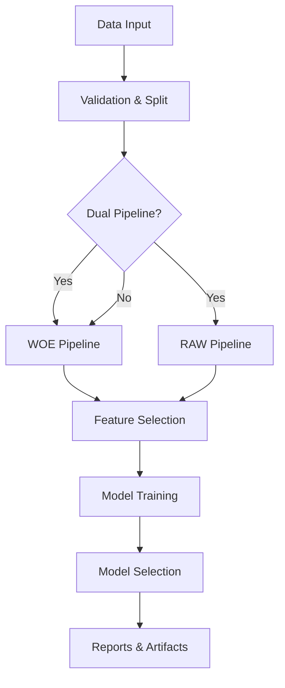

# Risk Model Pipeline

[](https://www.python.org/downloads/)
[](https://opensource.org/licenses/MIT)
[](https://github.com/psf/black)

A production-ready machine learning pipeline for credit risk modeling with advanced feature engineering, model selection, and stability monitoring.

## ✨ Features

- **🚀 Dual Pipeline Architecture**: Run WOE and RAW pipelines simultaneously
- **📊 Advanced Feature Engineering**: WOE binning, IV calculation, PSI monitoring
- **🎯 Smart Model Selection**: Balance performance and stability with configurable strategies
- **🔧 Multiple Imputation**: Preserve all data with various imputation methods
- **📈 Comprehensive Models**: Logistic, Tree-based (RF, XGBoost, LightGBM), GAM
- **📝 Production Ready**: Excel reports, model serialization, SHAP interpretability

## 📦 Installation

```bash
pip install git+https://github.com/selimoksuz/risk-model-pipeline.git
```

## 🚀 Quick Start

```python
from risk_pipeline import Config, RiskModelPipeline
import pandas as pd

# Load data
df = pd.read_csv("credit_data.csv")

# Configure
config = Config(
    id_col='app_id',
    time_col='app_date', 
    target_col='default_flag',
    enable_dual_pipeline=True,
    output_folder='outputs'
)

# Run pipeline
pipeline = RiskModelPipeline(config)
pipeline.run(df)

# Export reports
pipeline.export_reports()
```

## 🎯 Model Selection Strategies

### Traditional (Highest Performance)
```python
config = Config(model_selection_method='gini_oot')
```

### Stability-Focused
```python
config = Config(
    model_selection_method='stable',
    min_gini_threshold=0.5
)
```

### Balanced (Performance + Stability)
```python
config = Config(
    model_selection_method='balanced',
    model_stability_weight=0.3  # 30% stability, 70% performance
)
```

### Conservative (With Constraints)
```python
config = Config(
    model_selection_method='conservative',
    max_train_oot_gap=0.1  # Max 10% Train-OOT gap
)
```

## 🔄 Imputation Strategies

```python
config = Config(
    # Single strategy
    raw_imputation_strategy='median'  
    
    # Or multiple strategies (creates ensemble features)
    raw_imputation_strategy='multiple'
)
```

Available strategies:
- `median`, `mean`, `mode` - Statistical imputation
- `multiple` - Ensemble of multiple methods
- `target_mean` - Target-based imputation
- `forward_fill`, `interpolate` - Time series methods

## 📊 Pipeline Outputs

### Excel Report
- **models_summary** - Performance metrics for all models
- **best_model_vars** - Selected features with importance
- **woe_mapping** - WOE transformation details
- **psi_summary** - Population stability analysis
- **top20_iv** - Features ranked by Information Value

### Artifacts
- `best_model_*.joblib` - Serialized model
- `woe_mapping_*.json` - WOE transformations
- `final_vars_*.json` - Selected features

## ⚙️ Advanced Configuration

```python
config = Config(
    # Data
    id_col='app_id',
    time_col='app_dt',
    target_col='target',
    
    # Feature Engineering
    rare_threshold=0.01,       # Rare category threshold
    psi_threshold=0.25,        # PSI stability threshold  
    iv_min=0.02,              # Minimum Information Value
    rho_threshold=0.90,       # Correlation threshold
    
    # Model Training
    cv_folds=5,
    hpo_method='optuna',
    hpo_timeout_sec=300,
    hpo_trials=50,
    
    # Model Selection
    model_selection_method='balanced',
    model_stability_weight=0.3,
    
    # Output
    output_folder='outputs',
    random_state=42
)
```

## 📈 Workflow



## 📚 Documentation

- **[Wiki Documentation](docs/wiki/)** - Detailed parameter explanations and methodology
- **[Example Notebook](notebooks/01_dual_pipeline_example.ipynb)** - Complete pipeline walkthrough
- **[Example Scripts](examples/)** - Basic and advanced usage examples

## 🧪 Testing

```bash
pytest tests/
```

## 🤝 Contributing

1. Fork the repository
2. Create your feature branch (`git checkout -b feature/NewFeature`)
3. Commit changes (`git commit -m 'Add NewFeature'`)
4. Push to branch (`git push origin feature/NewFeature`)
5. Open a Pull Request

## 📄 License

MIT License - see [LICENSE](LICENSE) file for details.

## 👨‍💻 Author

**Selim Öksüz**
- GitHub: [@selimoksuz](https://github.com/selimoksuz)

## 🙏 Acknowledgments

- Built with scikit-learn, XGBoost, LightGBM
- WOE/IV methodology from credit scoring literature
- SHAP for model interpretability