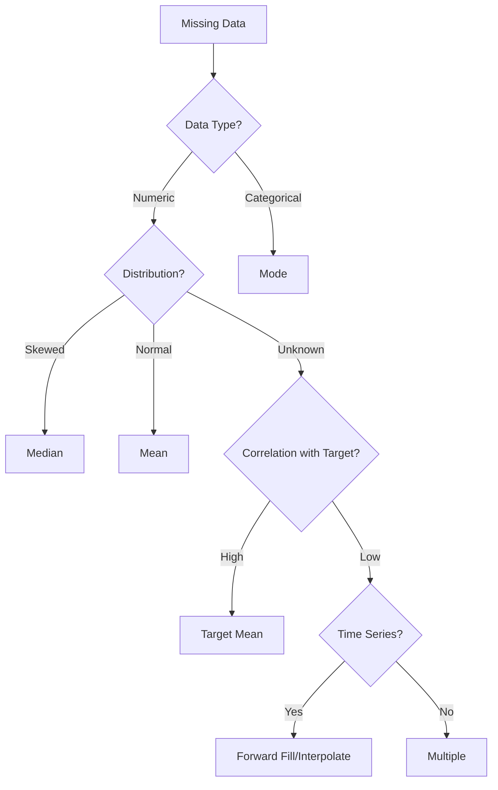

# Imputation Strategies

This page explains all imputation strategies available for handling missing values in the RAW pipeline.

## Table of Contents
- [Overview](#overview)
- [Single Imputation Methods](#single-imputation-methods)
- [Multiple Imputation Strategy](#multiple-imputation-strategy)
- [Target-Based Imputation](#target-based-imputation)
- [Time Series Methods](#time-series-methods)
- [Strategy Selection Guide](#strategy-selection-guide)

---

## Overview

**Parameter**: `raw_imputation_strategy`  
**Default**: `'median'`  
**Options**: `'median'`, `'mean'`, `'mode'`, `'multiple'`, `'target_mean'`, `'forward_fill'`, `'interpolate'`, `'knn'`

### Key Principle
**No data rows are ever dropped**. All missing values are imputed to preserve the complete dataset.

### How to Configure
```python
config = Config(
    raw_imputation_strategy='multiple'  # Choose imputation method
)
```

### Missing Indicators
For all strategies, the pipeline automatically creates binary indicators for missing values:
```
feature_was_missing = 1 if original value was NaN, else 0
```

---

## Single Imputation Methods

### 1. Median Imputation

**Parameter Value**: `'median'`  
**Best for**: Skewed numeric distributions

```python
config = Config(
    raw_imputation_strategy='median'
)
```

**How it works**:
1. Calculate median of non-missing values in training set
2. Replace all NaN with this median
3. Use same median for test/OOT sets

**Example**:
```python
# Original: [10, 20, NaN, 30, 100, NaN]
# Median: 25
# Imputed: [10, 20, 25, 30, 100, 25]
```

**Pros**:
- Robust to outliers
- Preserves distribution center
- Simple and fast

**Cons**:
- Reduces variance
- May create artificial concentration

### 2. Mean Imputation

**Parameter Value**: `'mean'`  
**Best for**: Normally distributed features

```python
config = Config(
    raw_imputation_strategy='mean'
)
```

**How it works**:
1. Calculate mean of non-missing values
2. Replace all NaN with mean
3. Apply same mean to test/OOT

**Example**:
```python
# Original: [10, 20, NaN, 30, 40, NaN]
# Mean: 25
# Imputed: [10, 20, 25, 30, 40, 25]
```

**Pros**:
- Preserves original mean
- Standard approach
- Fast computation

**Cons**:
- Sensitive to outliers
- Reduces variance
- Assumes normality

### 3. Mode Imputation

**Parameter Value**: `'mode'`  
**Best for**: Categorical or discrete features

```python
config = Config(
    raw_imputation_strategy='mode'
)
```

**How it works**:
1. Find most frequent value
2. Replace NaN with mode
3. If multiple modes, use first

**Example**:
```python
# Original: ['A', 'B', 'A', NaN, 'B', 'A', NaN]
# Mode: 'A'
# Imputed: ['A', 'B', 'A', 'A', 'B', 'A', 'A']
```

---

## Multiple Imputation Strategy

**Parameter Value**: `'multiple'`  
**Best for**: Creating ensemble features for better prediction

```python
config = Config(
    raw_imputation_strategy='multiple'
)
```

### How it works

Creates multiple imputed versions of each feature with missing values:

1. **Base imputation**: Median
2. **Additional versions**: Mean, forward fill, target mean
3. **Missing indicator**: Binary flag

### Example

Original feature: `income` with missing values

Generated features:
```
income              → Median imputed (base)
income_imp_mean     → Mean imputed version
income_imp_ffill    → Forward filled version
income_imp_target   → Target-based imputation
income_was_missing  → Binary indicator (1 if was NaN)
```

### Benefits

1. **Information preservation**: Different imputation methods capture different patterns
2. **Model flexibility**: Model can learn which imputation works best
3. **Uncertainty encoding**: Missing indicator helps model understand data quality

### Example Code
```python
# Before: 5 features with missing values
# Shape: (1000, 5)

config = Config(raw_imputation_strategy='multiple')

# After: Expanded feature set
# Shape: (1000, 20)  # 4x expansion + indicators
```

---

## Target-Based Imputation

**Parameter Value**: `'target_mean'`  
**Best for**: Features correlated with target

```python
config = Config(
    raw_imputation_strategy='target_mean'
)
```

### How it works

1. Calculate mean for target=0 and target=1 separately
2. Impute based on target value:
   - If target=0: Use mean from target=0 group
   - If target=1: Use mean from target=1 group
   - If target is NaN: Use overall mean

### Example
```python
# Feature: income
# Target=0 mean income: $50,000
# Target=1 mean income: $30,000

# Imputation:
# Customer with target=0 and missing income → $50,000
# Customer with target=1 and missing income → $30,000
```

### Advantages
- Preserves target-feature relationship
- Better than overall mean for predictive features
- Reduces bias in imputation

### Caution
- Risk of data leakage if not done carefully
- Only use target from training set
- May overfit if missing pattern is informative

---

## Time Series Methods

### Forward Fill

**Parameter Value**: `'forward_fill'`  
**Best for**: Time-ordered data with temporal continuity

```python
config = Config(
    raw_imputation_strategy='forward_fill'
)
```

**How it works**:
```python
# Original: [10, 20, NaN, NaN, 50, NaN]
# Forward filled: [10, 20, 20, 20, 50, 50]
```

**Use cases**:
- Customer status that doesn't change often
- Cumulative metrics
- Last known value scenarios

### Interpolation

**Parameter Value**: `'interpolate'`  
**Best for**: Smooth numeric trends

```python
config = Config(
    raw_imputation_strategy='interpolate'
)
```

**How it works**:
```python
# Original: [10, NaN, NaN, 40, NaN, 60]
# Interpolated: [10, 20, 30, 40, 50, 60]
```

**Methods**:
- Linear interpolation (default)
- Preserves trends
- Good for seasonal data

---

## Strategy Selection Guide

### Decision Framework



### Comparison Table

| Strategy | Speed | Accuracy | Complexity | Feature Expansion |
|----------|-------|----------|------------|------------------|
| Median | ★★★★★ | ★★★ | ★ | No |
| Mean | ★★★★★ | ★★★ | ★ | No |
| Mode | ★★★★★ | ★★ | ★ | No |
| Target Mean | ★★★★ | ★★★★ | ★★ | No |
| Forward Fill | ★★★★ | ★★★ | ★★ | No |
| Interpolate | ★★★ | ★★★ | ★★ | No |
| Multiple | ★★ | ★★★★★ | ★★★ | Yes (4-5x) |

### By Use Case

#### Credit Risk Models
```python
config = Config(
    raw_imputation_strategy='multiple'  # Best overall performance
)
```

#### Real-time Scoring
```python
config = Config(
    raw_imputation_strategy='median'  # Fast and simple
)
```

#### Time Series Data
```python
config = Config(
    raw_imputation_strategy='forward_fill'  # Preserves temporal patterns
)
```

---

## Implementation Details

### Missing Value Detection

The pipeline identifies missing values as:
- `np.nan`
- `None`
- `pd.NaT` (for datetime)
- Empty strings (for categorical)

### Train-Test Consistency

Imputation statistics are:
1. **Calculated on training set only**
2. **Applied to test and OOT sets**
3. **Stored for production scoring**

Example:
```python
# Training: Calculate median = 50
train_median = train_data['feature'].median()

# Test: Apply same median
test_data['feature'].fillna(train_median)

# OOT: Apply same median
oot_data['feature'].fillna(train_median)
```

### Feature Naming Convention

When multiple imputation creates new features:

```
Original: income
Generated:
  - income              (base, median)
  - income_imp_mean     (mean version)
  - income_imp_target   (target-based)
  - income_was_missing  (indicator)
```

---

## Best Practices

### 1. Understand Missing Patterns

Before choosing strategy, analyze:
- Missing completely at random (MCAR)
- Missing at random (MAR)
- Missing not at random (MNAR)

### 2. Validate Imputation

Always check:
- Distribution before/after imputation
- Correlation preservation
- Model performance impact

### 3. Document Decisions

Record:
- Why specific strategy was chosen
- Impact on model performance
- Any domain knowledge used

### 4. Monitor in Production

Track:
- Missing rates over time
- Imputation value drift
- Model performance stability

---

## Examples

### Example 1: E-commerce Model
```python
config = Config(
    # Multiple strategies for rich feature engineering
    raw_imputation_strategy='multiple',
    # Other settings...
)
```

### Example 2: Regulatory Model
```python
config = Config(
    # Simple, explainable method
    raw_imputation_strategy='median',
    # Other settings...
)
```

### Example 3: Customer Behavior Model
```python
config = Config(
    # Target-based for behavioral features
    raw_imputation_strategy='target_mean',
    # Other settings...
)
```