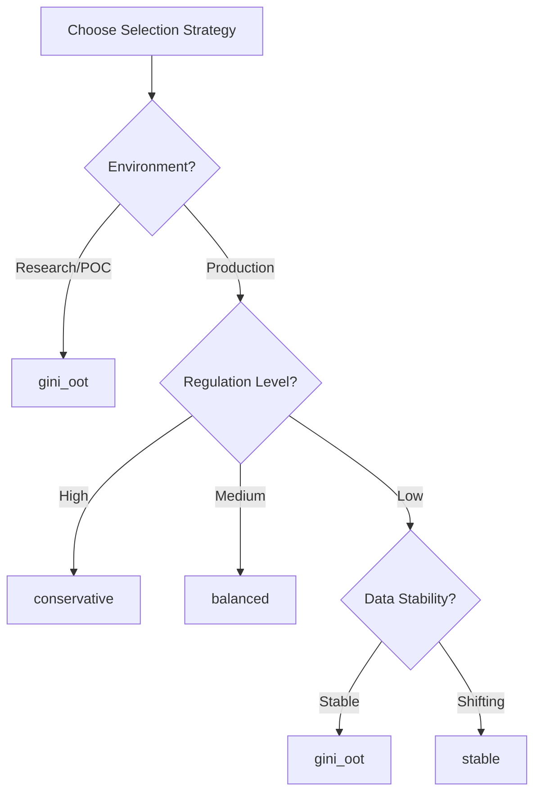

# Model Selection Criteria

This page explains the model selection strategies and parameters used to choose the best model from all trained candidates.

## Table of Contents
- [Model Selection Method](#model-selection-method)
- [Model Stability Weight](#model-stability-weight)
- [Max Train-OOT Gap](#max-train-oot-gap)
- [Min Gini Threshold](#min-gini-threshold)
- [Selection Strategies Comparison](#selection-strategies-comparison)

---

## Model Selection Method

**Parameter**: `model_selection_method`  
**Default**: `'gini_oot'`  
**Options**: `'gini_oot'`, `'stable'`, `'balanced'`, `'conservative'`

### Overview
Determines how the best model is selected from all trained models. Each method represents a different philosophy about the performance-stability trade-off.

```python
config = Config(
    model_selection_method='balanced'  # Choose selection strategy
)
```

### Available Methods

#### 1. `'gini_oot'` - Traditional Performance-Based
**Philosophy**: Maximum performance on out-of-time data  
**Best for**: When performance is paramount

```python
config = Config(
    model_selection_method='gini_oot'
)
```

**Selection Logic**:
```
1. Sort all models by Gini_OOT (descending)
2. Select model with highest Gini_OOT
3. Ignore stability considerations
```

**Example**:
| Model | Gini_Train | Gini_OOT | Train-OOT Gap | Selected |
|-------|------------|----------|---------------|----------|
| XGBoost | 0.85 | 0.78 | 0.07 | ✓ |
| Logistic | 0.75 | 0.74 | 0.01 | |
| Random Forest | 0.82 | 0.76 | 0.06 | |

#### 2. `'stable'` - Stability-Focused
**Philosophy**: Consistent performance across time periods  
**Best for**: Production systems requiring reliability

```python
config = Config(
    model_selection_method='stable',
    min_gini_threshold=0.5  # Minimum acceptable performance
)
```

**Selection Logic**:
```
1. Filter models with Gini_OOT >= min_gini_threshold
2. Calculate Train-OOT gap for each
3. Select model with smallest gap
```

**Example**:
| Model | Gini_Train | Gini_OOT | Train-OOT Gap | Selected |
|-------|------------|----------|---------------|----------|
| XGBoost | 0.85 | 0.65 | 0.20 | |
| Logistic | 0.70 | 0.68 | 0.02 | ✓ |
| Random Forest | 0.82 | 0.60 | 0.22 | |

#### 3. `'balanced'` - Weighted Combination
**Philosophy**: Balance between performance and stability  
**Best for**: General purpose, recommended default

```python
config = Config(
    model_selection_method='balanced',
    model_stability_weight=0.3  # 30% stability, 70% performance
)
```

**Selection Logic**:
```
Score = (1 - weight) × Gini_OOT - weight × |Train-OOT Gap|
```

**Example** (with weight=0.3):
| Model | Gini_OOT | Gap | Score | Selected |
|-------|----------|-----|-------|----------|
| XGBoost | 0.78 | 0.15 | 0.501 | |
| Logistic | 0.72 | 0.02 | 0.498 | |
| Random Forest | 0.75 | 0.08 | 0.501 | ✓ |

#### 4. `'conservative'` - Stability with Constraints
**Philosophy**: Prioritize stability, then maximize performance  
**Best for**: Highly regulated environments

```python
config = Config(
    model_selection_method='conservative',
    max_train_oot_gap=0.1  # Maximum allowed gap
)
```

**Selection Logic**:
```
1. Filter models with Train-OOT gap <= max_train_oot_gap
2. Sort by gap (ascending), then by Gini_OOT (descending)
3. Select first model
```

---

## Model Stability Weight

**Parameter**: `model_stability_weight`  
**Default**: `0.0`  
**Range**: `0.0 - 1.0`  
**Used with**: `'balanced'` method only

### What is it?
The weight given to stability when calculating the balanced score. Higher values prioritize consistency over raw performance.

### How it works
```python
config = Config(
    model_selection_method='balanced',
    model_stability_weight=0.3  # 30% weight on stability
)
```

### Formula
```
Balanced Score = (1 - w) × Performance + w × (1 - Normalized_Gap)

Where:
- w = model_stability_weight
- Performance = Gini_OOT
- Normalized_Gap = |Gini_Train - Gini_OOT| / max(all gaps)
```

### Interpretation

| Weight | Meaning | Use Case |
|--------|---------|----------|
| 0.0 | Pure performance (same as 'gini_oot') | Research, competitions |
| 0.1-0.2 | Performance-focused with stability consideration | Most production systems |
| 0.3-0.4 | Balanced approach | Recommended default |
| 0.5 | Equal weight | When both equally important |
| 0.6-0.8 | Stability-focused | Risk-averse environments |
| 0.9-1.0 | Pure stability (similar to 'stable') | Critical systems |

### Example Scenarios

#### Scenario 1: Weight = 0.0 (Performance only)
```python
# Models:
# A: Gini_OOT=0.80, Gap=0.20 → Score=0.80
# B: Gini_OOT=0.75, Gap=0.05 → Score=0.75
# Selected: A (highest performance)
```

#### Scenario 2: Weight = 0.3 (Balanced)
```python
# Models:
# A: Gini_OOT=0.80, Gap=0.20 → Score=0.56
# B: Gini_OOT=0.75, Gap=0.05 → Score=0.64
# Selected: B (better balance)
```

#### Scenario 3: Weight = 0.7 (Stability-focused)
```python
# Models:
# A: Gini_OOT=0.80, Gap=0.20 → Score=0.24
# B: Gini_OOT=0.75, Gap=0.05 → Score=0.55
# Selected: B (more stable)
```

---

## Max Train-OOT Gap

**Parameter**: `max_train_oot_gap`  
**Default**: `None` (no limit)  
**Range**: `0.0 - 1.0`  
**Used with**: All methods (as filter)

### What is it?
Maximum allowed difference between training and out-of-time performance. Models exceeding this gap are excluded from selection.

### How it works
```python
config = Config(
    max_train_oot_gap=0.15  # Max 15% performance degradation
)
```

### Purpose
- Prevents selecting overfit models
- Ensures deployment stability
- Acts as a safety constraint

### Example
```python
# Models and their gaps:
# XGBoost:    Gini_Train=0.85, Gini_OOT=0.65, Gap=0.20 ✗ (exceeds 0.15)
# LightGBM:   Gini_Train=0.82, Gini_OOT=0.70, Gap=0.12 ✓
# Logistic:   Gini_Train=0.72, Gini_OOT=0.68, Gap=0.04 ✓
# 
# Only LightGBM and Logistic considered for selection
```

### Best Practices

| Model Type | Recommended Max Gap | Rationale |
|------------|-------------------|-----------|
| Linear models | 0.05-0.10 | Should be very stable |
| Tree-based | 0.10-0.20 | Some overfitting expected |
| Neural networks | 0.15-0.25 | Higher capacity models |
| Ensemble | 0.10-0.15 | Should balance overfitting |

---

## Min Gini Threshold

**Parameter**: `min_gini_threshold`  
**Default**: `0.5`  
**Range**: `0.0 - 1.0`  
**Used with**: `'stable'` method primarily

### What is it?
Minimum acceptable Gini coefficient on OOT data. Ensures selected model meets performance requirements.

### How it works
```python
config = Config(
    model_selection_method='stable',
    min_gini_threshold=0.6  # Require at least 0.6 Gini
)
```

### Purpose
- Sets performance floor
- Prevents selecting stable but weak models
- Balances stability requirements

### Example
```python
# Models:
# Model A: Gini_OOT=0.55, Gap=0.01  ✗ (below threshold)
# Model B: Gini_OOT=0.65, Gap=0.05  ✓
# Model C: Gini_OOT=0.70, Gap=0.10  ✓
# 
# With 'stable' method: Select B (acceptable performance, lower gap)
```

### Industry Standards

| Industry | Typical Min Gini | Note |
|----------|-----------------|------|
| Credit Cards | 0.60-0.70 | Higher due to rich data |
| Personal Loans | 0.55-0.65 | Moderate requirements |
| Mortgages | 0.50-0.60 | Lower due to low default rates |
| SME Lending | 0.45-0.55 | Limited data availability |

---

## Selection Strategies Comparison

### Decision Tree for Choosing Strategy



### Comparison Table

| Strategy | Performance Focus | Stability Focus | Complexity | Use Case |
|----------|------------------|-----------------|------------|----------|
| `gini_oot` | ★★★★★ | ★ | Simple | Competitions, research |
| `stable` | ★★ | ★★★★★ | Simple | Volatile markets |
| `balanced` | ★★★★ | ★★★ | Moderate | General purpose |
| `conservative` | ★★★ | ★★★★ | Complex | Regulated industries |

### Real-World Examples

#### Example 1: Credit Card Risk Model
```python
config = Config(
    model_selection_method='balanced',
    model_stability_weight=0.3,
    max_train_oot_gap=0.15,
    min_gini_threshold=0.60
)
# Reasoning: Need good performance but also stability for daily scoring
```

#### Example 2: Regulatory Capital Model
```python
config = Config(
    model_selection_method='conservative',
    max_train_oot_gap=0.10,
    min_gini_threshold=0.50
)
# Reasoning: Stability crucial for regulatory approval
```

#### Example 3: Marketing Response Model
```python
config = Config(
    model_selection_method='gini_oot',
    min_gini_threshold=0.40
)
# Reasoning: Performance matters most, can retrain frequently
```

---

## Advanced Configuration Examples

### Extreme Stability Focus
```python
config = Config(
    model_selection_method='stable',
    min_gini_threshold=0.55,
    max_train_oot_gap=0.05  # Very strict
)
```

### Performance with Safety Net
```python
config = Config(
    model_selection_method='gini_oot',
    max_train_oot_gap=0.20  # Safety constraint only
)
```

### Custom Balanced Approach
```python
config = Config(
    model_selection_method='balanced',
    model_stability_weight=0.4,  # 40% stability
    max_train_oot_gap=0.15,      # Hard constraint
    min_gini_threshold=0.55       # Performance floor
)
```

## Monitoring and Validation

After model selection, monitor:

1. **Performance Metrics**
   - Gini/AUC on new data
   - Prediction distribution
   - Score stability

2. **Stability Indicators**
   - Monthly Train-OOT gap
   - Feature importance shifts
   - Prediction volatility

3. **Business Metrics**
   - Approval rates
   - Default rates
   - Portfolio composition